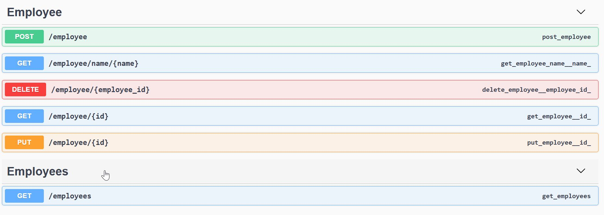

Note: Иногда сервер засыпает минут через 20

<h1> Промежуточная аттестация 3</h1>
<h2> Напишите автотесты на API сервиса x-clients, модуль employee</h2>
<h3> Тесты должны покрывать следующие эндпоинты:</h3>

**Условия:**
- Тесты должны быть как позитивные, так и негативные
- Тесты должны быть контрактные и на бизнес-логику
- Обязательно необходимо использовать работу с БД для создания предусловий/постусловий
- Выбор библиотек (для работы с HTTP, базой данных и прочим) на усмотрение выполняющего
- Решение сдается в виде ссылки на репозиторий + архив.

<h3> Реквизиты </h3>

- Swagger: https://innopolispython.onrender.com/apidocs/#/ 
- Данные для подкл. к БД: 
- Строка: postgresql://dpg-d2o8fqjipnbc73begg4g-a.oregon-postgres.render.com/employee_postgres_2 
- Логин: admin 
- Пароль: azaHlBwfeeGxwEUt07mK6xtGrwBC1DCK 

- Напоминаю, что сервис может отвечать долго на первый запрос после продолжительного простоя.
<h3> Критерии оценки: </h3>

- Тесты запускаются
- Если тесты падают в результате багов, необходимо использовать аннотацию @Disabled с описанием причины. Также внутри проекта создать файл BAGS.MD и описать в нем краткие баг репорты.
- Оценивается тестовое покрытие проекта. Уделите внимание техникам тест-дизайна.
- Тесты должны быть стабильны (при повторном запуске тестов, получаем один и тот же результат)
- Оценивается чистота кода и архитектуры проекта (разделение на классы, пакеты, создание хэлперов, вынесение констант в отдельный файл, избежание самоповтора, неиспользуемых переменных и т.д.).

